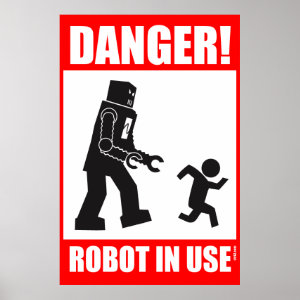

**Fast bot check for low level (TCP/UDP) protocols without IP, UserAgent or System check based on proof of work.**

Checking for a bot is done with proof of work. Client needs to find
hash starting with 0, 1, 2 or 4. This implementation allows you to check the legality
of connection. To bypass this check the attacker must have very large computing resources.
Also this check method allows dont keep blocked IP's, check user-agent or system which
can be spoofed.
Hard level is the number of characters equal to the beginning of the hash.
****
**```SERVER```**

**genBotCheckTask**(char* taskOutput, int hardLevel) - **Generate bot check task**

**confirmBotCheckTask**(char* task, char* solution) - **Return 1 if client pass check and 0 if client is bot**

**```CLIENT```**

**passBotCheck**(char* task, char* solution) - **Takes task and put result to solution**
****
**test.c** contains all BotCheck lib functions, example output:
```
Dqqh|8|              <- Dqqh is task base, 8 is hardLevel 
Solution is: 132975
Client is't bot! :)
```
 
|Hard level| ~Time |
|---|---|
|6|0.1 sec|
|8|1.5 sec|
|10|2.5 sec|
|12|12 sec|
****

|Hard level|Argon2 client\`s calls|Argon2 server\`s calls|
|---|---|---|
|6|80|1|
|8|700|1|
|10|1100|1|
|12|4500|1|

Download https://github.com/P-H-C/phc-winner-argon2 src to compile **libargon2.a**

> [!WARNING]
> Too low a level of complexity reduces the verification time, but also makes such a check unreliable



